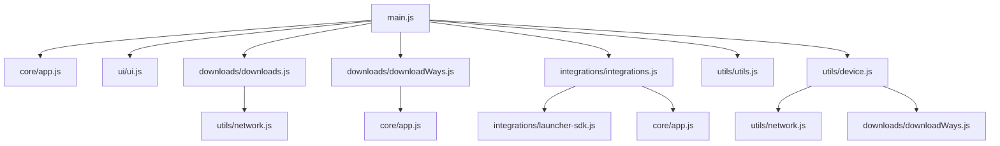

# 模块化结构说明

## 目录结构

```
js/
├── lib/                    # 第三方库
├── modules/                # 自定义模块
│   ├── core/              # 核心应用模块
│   ├── ui/                # 用户界面模块
│   ├── downloads/         # 下载相关模块
│   ├── integrations/      # 第三方集成模块
│   └── utils/             # 工具函数模块
├── main.js                # 主入口文件
└── index.js                # 原始文件（简化版备份）
```

## 模块依赖关系



## 各模块功能说明

### core/app.js
- 核心应用初始化逻辑
- 全局状态变量管理
- 应用启动流程控制
- 性能监控和加载时间记录

### ui/ui.js
- 用户界面相关功能
- 主题管理
- 弹窗和提示功能
- 路由处理

### downloads/downloads.js
- 内容加载逻辑
- 页面内容管理
- 赞助列表加载

### downloads/downloadWays.js
- 各种下载线路实现
- 版本面板创建
- 架构链接映射
- 数据源映射表(SOURCE_MAP)

### integrations/integrations.js
- 第三方服务集成
- Launcher SDK接口封装
- 各种列表加载功能

### integrations/launcher-sdk.js
- Launcher SDK模拟实现

### utils/utils.js
- 通用工具函数
- 状态管理
- 冷却功能
- 运行时间计算

### utils/device.js
- 设备信息检测
- 架构匹配
- 安卓版本检测
- 开门见山功能实现

### utils/network.js
- 网络请求封装
- 内容获取功能

## 性能监控功能

### 加载时间记录
- 记录每个模块的加载时间
- 在公告页面显示总体加载时间和各模块加载时间
- 提供性能分析数据

### 实现方式
1. 在core/app.js中添加`moduleLoadTimes`对象记录各模块加载时间
2. 添加`recordModuleLoadTime`函数记录单个模块加载时间
3. 添加`displayModuleLoadTimes`函数在公告页面显示各模块加载时间
4. 在公告页面notice.html中添加专门的性能显示版块

## 性能优化措施

### 1. 开门见山链接获取优化 (原1820ms)
**优化措施**：
- 并行加载odlm页面和获取数据
- 优化网络请求和数据解析流程
- 减少不必要的等待时间

### 2. 下载TAB内容获取优化 (原605ms)
**优化措施**：
- 预先绑定事件监听器以提高响应性
- 优化DOM操作和事件处理

### 3. 地址栏参数解析优化 (原66ms)
**优化措施**：
- 使用防抖优化频繁调用
- 使用URLSearchParams提高解析性能
- 优化DOM操作和滚动行为

### 4. 设备信息获取优化 (原39ms)
**优化措施**：
- 延迟导入browser-helper库
- 延迟加载非关键资源
- 优化DOM操作

### 5. 公告打开优化 (原354ms)
**优化措施**：
- 预加载公告内容
- 优化错误处理和缓存机制

### 6. 网络请求优化
**优化措施**：
- 添加内容缓存机制
- 优化fetch请求参数
- 添加错误处理和重试机制

### 7. 核心应用初始化优化
**优化措施**：
- 并行初始化可并行的模块
- 预加载关键资源
- 优化加载顺序和依赖关系

## 架构升级公告

我们在2025年8月的更新中实施了重大架构升级：

### 🚀 模块化重构
- **系统架构**：将原有的单体应用重构为模块化架构，实现高内聚、低耦合的设计理念
- **代码组织**：按功能将代码拆分为core、ui、downloads、integrations、utils等独立模块
- **依赖管理**：使用ES6模块系统明确模块间依赖关系，提高代码可维护性

### ⚡ 性能优化
- **加载优化**：通过并行处理、缓存机制和延迟加载等技术手段显著提升页面加载速度
- **资源管理**：优化关键路径资源加载，减少不必要的网络请求
- **DOM操作**：优化DOM查询和更新操作，减少重排重绘

### 📊 性能监控
- **实时监控**：在公告页面添加性能监控面板，实时显示各模块加载耗时
- **数据分析**：为持续性能优化提供数据支持

### 🎨 用户体验
- **界面优化**：保持Material Design风格的同时提升交互体验
- **信息展示**：通过卡片式布局清晰展示技术升级内容

## 优化说明

1. **模块解耦**：将原有单一文件按功能拆分为多个独立模块，降低耦合度
2. **职责分离**：每个模块只负责特定功能，提高可维护性
3. **依赖管理**：通过ES6模块系统明确模块间依赖关系
4. **可扩展性**：新增功能只需添加相应模块，不影响现有代码
5. **可测试性**：独立模块便于单元测试
6. **性能监控**：添加加载时间记录和显示功能，便于性能分析
7. **性能优化**：针对关键性能瓶颈进行优化，提升用户体验

## 使用说明

1. 保留了与原代码的兼容性，所有函数仍可通过window对象访问
2. 通过main.js作为统一入口管理所有模块
3. 使用ES6模块系统进行模块导入导出

## 修复的问题

1. **SOURCE_MAP未定义问题**：将SOURCE_MAP移到downloadWays.js中，并在device.js中正确导入
2. **全局变量修改问题**：修复了尝试修改const变量的问题，改为直接修改window对象上的属性
3. **模块导入导出问题**：确保所有模块正确导入和导出所需变量和函数